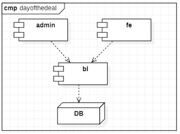

# Deal Of The Day

*Deal Of The Day* is a web-based business, in which a single type of product is offered for sale for 
a short period of time.
Registered clients will receive a daily newsletter through the email with the details of the "deal of the day".
If the user is interested for the published good, he can login and purchase the good.<br/>
At the publishing expires time, the system will count if the number of purchases has reached the minimum 
asked from the partner in order that the deal can be considered done. 
Only in this case the deal is considered "concluded", and the *Coupons* will be sent through
email to the users. 
In case the minimum numbers of purchases is not been reached, the system
will send a notification message to users whom purchased the good, confirming that the money
used in the purchased time will be recharged in the same credit card used for the purchase. 

To permit this goal the system will be composed by two modules:
- deayofthedeal website, usually configured to a public DNS  like www.deayofthedeal.com
- deayofthedeal Admin Tool, Back-end tool for administrators.


# Architectural Design 

Three tier/layer architecture will be used for designing the system.
- Data Layer
- Business Layer
- Presentation Layer

The project *dayofthedeal* is composed by three modules: 



## Data Layer

As database management system will be used **Oracle** and the persistence **JPA** will be used as *Object Relational Mapper*
to map the relational database into java objects.

For each database table will be a *DAO(Data Access Object)* java interface which exposes the
access methods and another class implementing the interface. This choice is to separate the
implementation from the specific. In case we need to change the *Object Relational Mapper* in the future, will be
necessary to change only the implementation classes and let immutable all the system.


```
public abstract class GenericDao {
    @PersistenceContext
    protected EntityManager entityManager;
}
```
```
public interface PartnerDao {
    PartnerEntity insert(PartnerEntity partnerEntity);
}
```
```	
public class PartnerDaoImpl extends GenericDao implements PartnerDao {
    public PartnerEntity insert(PartnerEntity partnerEntity) {
        entityManager.persist(partnerEntity);
        return partnerEntity;
    }
}
```

## Business Layer

In this layer are present all the Services. <br/>
Each Service class is responsible for a specific business part. 
Example, PartnerService define all activities done for a partner.
A Service can use more than one `DAO`, but a `DAO` must not use another `DAO`.
Transactions will be configured in this layer using `Spring` `@Transactional`
This means that each Service method with be `ATOMIC`: the `commit` in `database` will happen only 
if the method ends with no Exceptions; otherwise a rollback will occur. 

Example:
```
1. public void deleteExpense(id){
2.     ExpenseItemDAO.deleteItemsByExpenseId(id);
3.     ExpenseDAO.deleteExpense(id);
4. }
```
- In case of any exception in line 3, transactions guaranties a rollback, for `deleteItemsByExpId()`,
- In case success, `commit` for both tables in `database`.

## Presentation Layer

Web layer will use `Business Layer` to interact with the `database`.
In this Layer will be present two components:
- dealofthedeal-admin
- dealofthedeal-fe


